<div align="center">

# 🛡️ CYBER_SECURE

### Advanced Password Strength Analyzer

[](https://opensource.org/licenses/MIT)
[](https://reactjs.org/)
[]()
[]()

*A scientifically-accurate, privacy-first password analysis tool with real-time breach detection.*

[🌐 Live Demo](https://password-strength-checker.vercel.app) · [📖 Technical Docs](./TECHNICAL.md) · [🐛 Report Bug](https://github.com/nickigann03/password-strength-checker/issues)

</div>

---

## 🎮 What is CYBER_SECURE?

**CYBER_SECURE** is a comprehensive password strength analyzer that goes far beyond simple length checks. It combines mathematical entropy calculation, behavioral pattern recognition, breach database queries, and NIST compliance checking—all processed **100% client-side** for maximum privacy.

Built with a stunning **Cyberpunk 2077-inspired aesthetic**, it gamifies the password creation process while educating users on security best practices.

> ⚠️ **Security Notice**: Your password never leaves your browser. The only external call is to the Have I Been Pwned API using k-Anonymity (only a 5-character hash prefix is sent).


---

## ✨ Features

### 🧠 The Brain — Core Analysis
| Feature | Description |
|---------|-------------|
| **Entropy Calculation** | Calculates true randomness in bits using `E = log₂(R^L)` |
| **Multi-Scenario Crack Times** | Estimates for Single PC, Botnet & Supercomputer attacks |
| **Character Set Detection** | Identifies lowercase, uppercase, numbers, symbols & Unicode/Emoji |
| **Pattern Recognition** | Detects keyboard walks (`qwerty`), sequences (`abcde`), repetition (`aaaa`) |
| **Leet Speak Detection** | Catches `P@ssw0rd`, `4dm1n`, `l33t` patterns |
| **Personal Info Check** | Optional PII correlation (name, email, birth year, phone) |

### 🔍 The Detective — Vulnerability Detection
| Feature | Description |
|---------|-------------|
| **HIBP Integration** | Checks 600M+ breached passwords via k-Anonymity API |
| **Breach Count Display** | Shows exact exposure count (e.g., "Found 1,402 times") |
| **NIST SP 800-63B Compliance** | Validates against federal security guidelines |
| **Contextual Warnings** | Specific reasons like "Contains year 1995" or "Uses sports team name" |

### 🛡️ The Shield — Privacy Architecture
| Feature | Description |
|---------|-------------|
| **100% Client-Side** | All analysis runs in your browser via JavaScript |
| **k-Anonymity API** | Only 5-char SHA-1 prefix sent to HIBP |
| **Auto-Clear Timer** | 60-second countdown clears sensitive input |
| **Clipboard Protection** | Disabled autocomplete, autocorrect & spellcheck |

### 🎨 The Face — User Experience
| Feature | Description |
|---------|-------------|
| **Dynamic Strength Meter** | HP-bar visualization with color gradients |
| **Character Breakdown** | Real-time count of each character type |
| **Password Generator** | Cryptographically secure with customizable options |
| **Passphrase Suggestions** | Diceware-style recommendations (`correct-horse-battery-staple`) |
| **Gamification** | 7 unlockable achievements for security milestones |

### 📚 The Teacher — Education
| Feature | Description |
|---------|-------------|
| **"Why is this weak?"** | Expandable panel explaining each vulnerability |
| **Severity Levels** | Color-coded: 🔴 Critical, 🟡 Warning, 🔵 Info |
| **Phishing Warning** | Prominent banner reminding users of security hygiene |

---

## �️ Tech Stack

| Layer | Technology |
|-------|------------|
| **Frontend** | React 19, Hooks (useState, useEffect, useRef, useCallback) |
| **Styling** | Vanilla CSS3, CSS Variables, Glassmorphism, Animations |
| **Icons** | Lucide React (tree-shakeable SVGs) |
| **Cryptography** | Web Crypto API (SHA-1, getRandomValues) |
| **Audio** | Web Audio API (oscillator-based SFX) |
| **External API** | Have I Been Pwned (k-Anonymity) |

---

## � Getting Started

### Prerequisites
- Node.js 18+
- npm or yarn

### Local Development

```bash
# Clone the repository
git clone https://github.com/nickigann03/password-strength-checker.git
cd password-strength-checker

# Install dependencies
npm install

# Start development server
npm start

# Build for production
npm run build
```

The app will be available at `http://localhost:3000`

---

## 🚀 Deployment

### Vercel (Recommended)
```bash
# Install Vercel CLI
npm i -g vercel

# Deploy
vercel
```

Or connect your GitHub repo directly at [vercel.com](https://vercel.com) for automatic deployments.

---

## 📐 Architecture Overview

```mermaid
flowchart TB
    subgraph Client["🖥️ Browser (100% Client-Side)"]
        UI["React UI Components"]
        Engine["Security Analysis Engine"]
        Audio["Sound Engine"]
        Crypto["Web Crypto API"]
    end

    subgraph External["🌐 External (Privacy-Safe)"]
        HIBP["Have I Been Pwned API"]
    end

    User["👤 User Input"] --> UI
    UI --> Engine
    Engine --> Crypto
    Crypto -->|"SHA-1 (5-char prefix only)"| HIBP
    HIBP -->|"Matching Suffixes"| Engine
    Engine -->|"Local Match"| UI
    Engine --> Audio
```



---

## 🔐 Security Guarantees

1. **Zero Server Storage** — No backend, no database, no logs
2. **Password Never Transmitted** — Only 5-char hash prefix for HIBP
3. **Works Offline** — All analysis except breach check works without internet
4. **Open Source** — Full code audit available
5. **Auto-Clear** — Sensitive data wiped after 60s inactivity

---

## 📈 Future Roadmap

- [ ] WebAssembly-accelerated entropy calculation
- [ ] Password manager export (Bitwarden/1Password format)
- [ ] Browser extension version
- [ ] Custom wordlist upload
- [ ] Multi-language support
- [ ] Dark/Light theme toggle

---

## 🤝 Contributing

Contributions are welcome! Please read our contributing guidelines before submitting PRs.

1. Fork the repository
2. Create your feature branch (`git checkout -b feature/amazing-feature`)
3. Commit your changes (`git commit -m 'Add amazing feature'`)
4. Push to the branch (`git push origin feature/amazing-feature`)
5. Open a Pull Request

---

## 📝 License

This project is licensed under the MIT License - see the [LICENSE](LICENSE) file for details.

---

<div align="center">

**Built with 🔒 and React. Your passwords are safe with us (because we never see them).**

</div>
