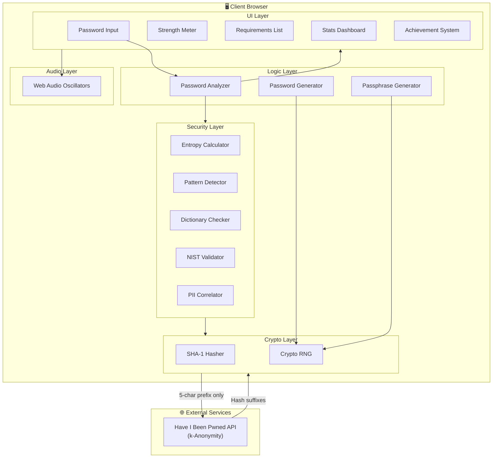
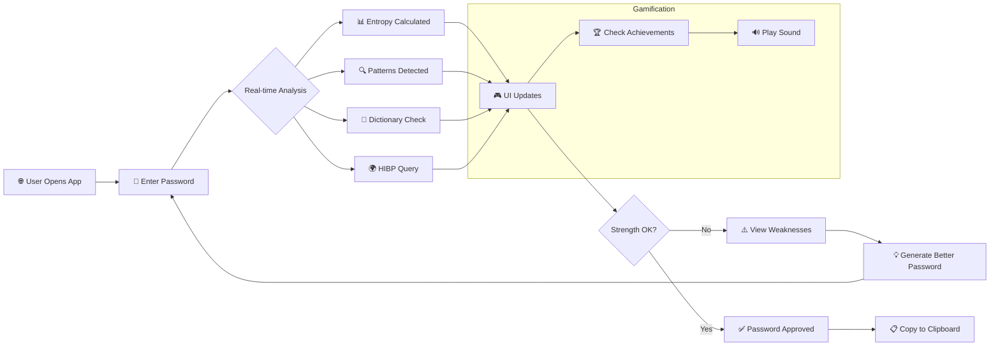
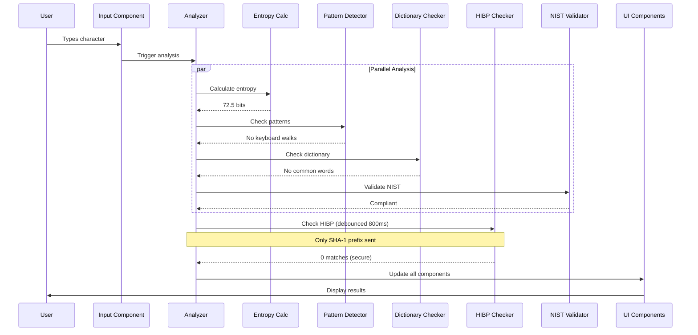
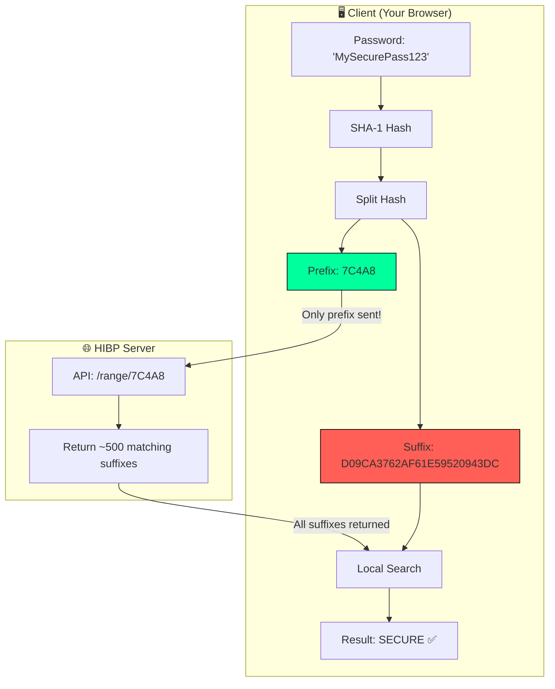
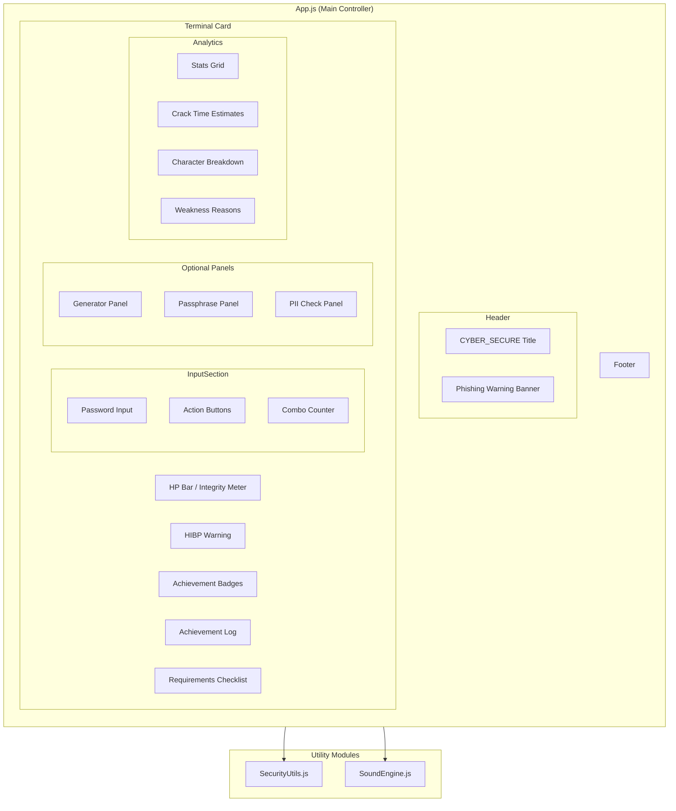
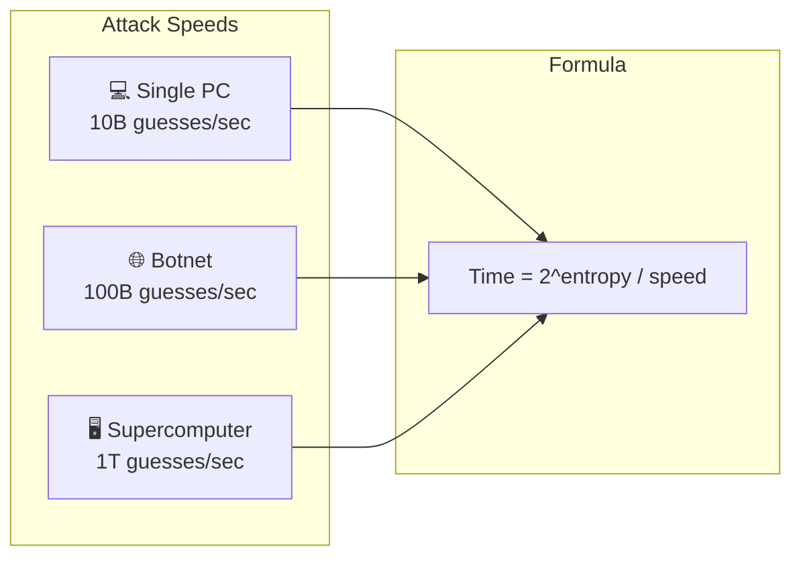
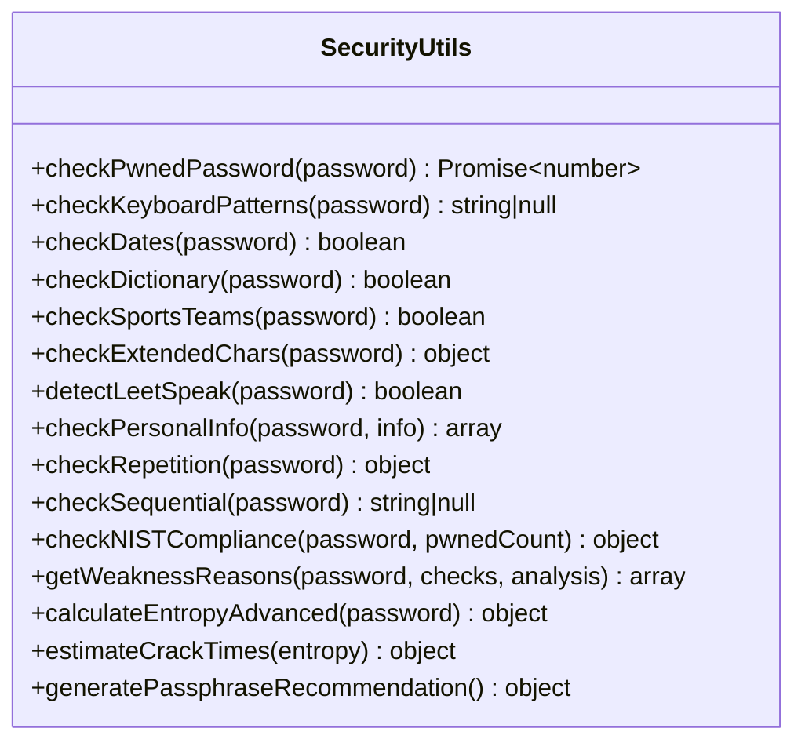
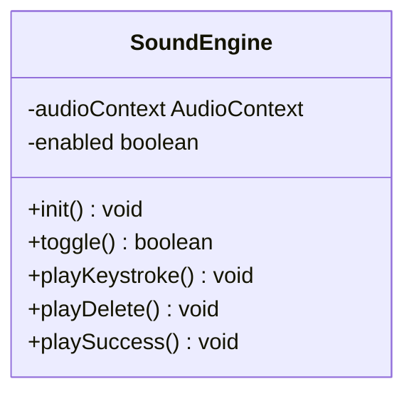

# 📐 Technical Documentation — CYBER_SECURE V4.0

> Comprehensive technical overview of the password strength analyzer architecture, data flows, and security implementations.

---

## 📊 Table of Contents

1. [System Architecture](#-system-architecture)
2. [User Flow](#-user-flow)
3. [Password Analysis Pipeline](#-password-analysis-pipeline)
4. [HIBP Integration Flow](#-hibp-integration-flow)
5. [Component Architecture](#-component-architecture)
6. [Security Logic Details](#-security-logic-details)
7. [Data Models](#-data-models)
8. [API Reference](#-api-reference)
9. [Performance Optimizations](#-performance-optimizations)
10. [Browser Compatibility](#-browser-compatibility)

---

## 🏗️ System Architecture

The application follows a purely client-side architecture with a single external API integration for breach checking.



---

## 👤 User Flow

The complete user journey from initial load to password validation.



---

## 🔬 Password Analysis Pipeline

Detailed sequence of how a password is analyzed in real-time.



---

## 🔐 HIBP Integration Flow

Privacy-preserving breach detection using k-Anonymity.



**Privacy Guarantees:**
- ✅ Full password **never** leaves the browser
- ✅ Only 5 characters of the SHA-1 hash are transmitted
- ✅ Server cannot determine which suffix matches
- ✅ Works the same whether password is found or not

---

## 🧩 Component Architecture

React component hierarchy and relationships.



---

## 🧮 Security Logic Details

### Entropy Calculation

```
E = log₂(R^L)
```

| Character Set | Pool Size (R) |
|--------------|---------------|
| Lowercase (a-z) | 26 |
| Uppercase (A-Z) | 26 |
| Numbers (0-9) | 10 |
| Symbols (!@#$...) | 32 |
| Extended ASCII | 128 |
| Unicode/Emoji | 1000+ |

**Example:** A 12-character password using lowercase + uppercase + numbers + symbols:
```
R = 26 + 26 + 10 + 32 = 94
E = log₂(94^12) = 78.7 bits
```

### Crack Time Scenarios



### Pattern Detection

| Pattern Type | Detection Method | Example |
|-------------|------------------|---------|
| Keyboard Walks | QWERTY adjacency matrix | `qwerty`, `asdf` |
| Sequential | Alphabet/number order | `abcde`, `12345` |
| Repetition | Regex: `(.)\1{2,}` | `aaaaa`, `111` |
| Leet Speak | Character mapping | `P@ssw0rd` → `password` |
| Dates | Regex: `/(19|20)\d{2}/` | `1995`, `2024` |
| Dictionary | Word list inclusion | `password`, `admin` |
| Sports Teams | Curated list | `arsenal`, `lakers` |

---

## 📦 Data Models

### Password Check State

```typescript
interface PasswordChecks {
  length: boolean;        // >= 12 characters
  hasLower: boolean;      // a-z present
  hasUpper: boolean;      // A-Z present
  hasNumber: boolean;     // 0-9 present
  hasSpecial: boolean;    // Symbols present
  hasExtended: boolean;   // Unicode/Emoji
  types: boolean;         // All 4 basic types
  noCommon: boolean;      // No dictionary words
  noSequential: boolean;  // No patterns
  noRepeating: boolean;   // No repetition
  minEntropy: boolean;    // >= 60 bits
  noPwned: boolean;       // Not in breaches
  noDates: boolean;       // No year patterns
  noSportsTeam: boolean;  // No team names
  noLeetSpeak: boolean;   // No obvious leet
  nistCompliant: boolean; // Meets NIST guidelines
}
```

### Weakness Reason

```typescript
interface WeaknessReason {
  severity: 'critical' | 'warning' | 'info';
  message: string;
}
```

### Crack Time Estimate

```typescript
interface CrackTimeEstimate {
  name: string;
  guessesPerSec: number;
  icon: string;
  time: {
    value: string | number;
    unit: string;
  };
  seconds: number;
}
```

---

## 🔌 API Reference

### SecurityUtils.js Exports



### SoundEngine.js



---

## ⚡ Performance Optimizations

| Optimization | Implementation |
|-------------|----------------|
| **Debounced HIBP** | 800ms delay before API call |
| **useCallback** | Memoized password generator |
| **Lazy Panels** | Generator/Passphrase panels render on demand |
| **Canvas Optimization** | Sparse matrix rain with RAF |
| **Parallel Analysis** | All checks run simultaneously |

---

## 🌐 Browser Compatibility

| Feature | Chrome | Firefox | Safari | Edge |
|---------|--------|---------|--------|------|
| Web Crypto API | 37+ | 34+ | 11+ | 12+ |
| CSS Variables | 49+ | 31+ | 9.1+ | 15+ |
| Backdrop Filter | 76+ | 103+ | 9+ | 17+ |
| Web Audio API | 35+ | 25+ | 6+ | 12+ |

---

## 📁 Directory Structure

```
password-strength-checker/
├── public/
│   ├── index.html
│   └── favicon.ico
├── src/
│   ├── App.js              # Main component & state
│   ├── App.css             # Minimal overrides
│   ├── PasswordChecker.css # Full cyberpunk theme
│   ├── SecurityUtils.js    # All security logic
│   ├── SoundEngine.js      # Web Audio implementation
│   ├── index.js            # Entry point
│   └── index.css           # Global resets
├── README.md               # Project overview
├── TECHNICAL.md            # This file
├── package.json
└── .gitignore
```

---

## 🔄 Version History

| Version | Date | Changes |
|---------|------|---------|
| **4.0** | Dec 2024 | NIST compliance, PII check, passphrase generator, character breakdown, multiple crack estimates |
| **3.0** | Nov 2024 | HIBP integration, gamification, password generator |
| **2.0** | Oct 2024 | Pattern detection, dictionary checks |
| **1.0** | Sep 2024 | Initial release |

---

<div align="center">

**Built with 🔒 and React. Your passwords are safe with us (because we never see them).**

</div>
